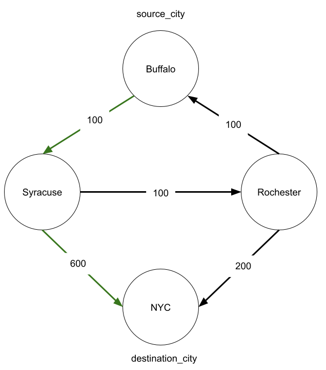
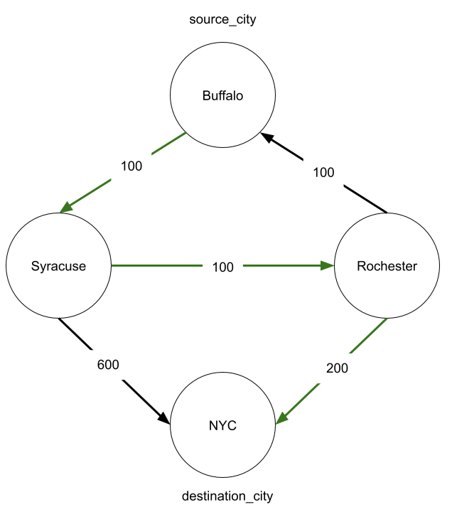
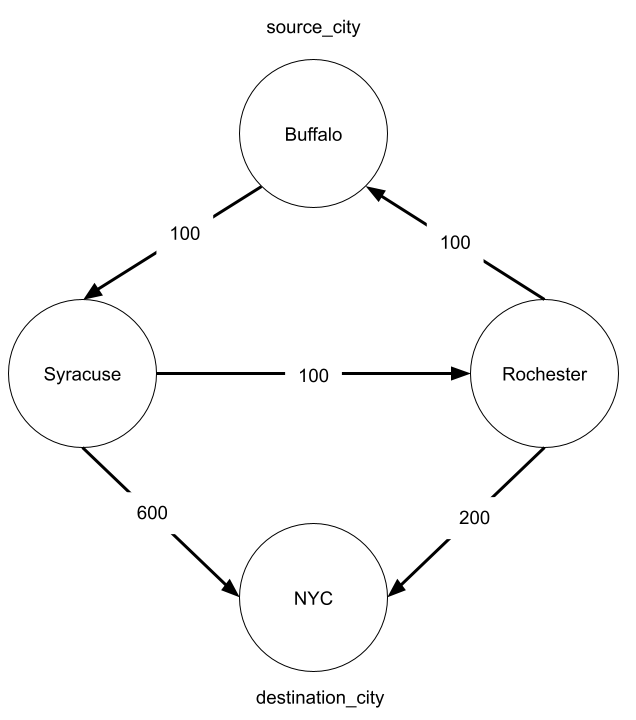

## Lesson: Graphs Part 2
### Date: 10/27/22

# Cheapest Flight with Limited Layovers

## Problem Statement
Ada Airlines offers some number of flights connecting 'n' cities. They have a list of all of their flights `flights` where each item in the list `[departure_city, arrival_city, price]` represents a flight from `departure_city` to `arrival_city` that costs `price`. 

Provided with the list of `flights` Ada Airlines currently offers, the overall number of cities they fly to `cities`,  a customer's `source_city`, `destination_city`, and an integer `max_layovers`, return the price of Ada's cheapest route between the `source_city` and `destination_city` that has at most `max_layovers` layovers. 

The source and destination city do not count as a layover. If there is no route between the two cities, return -1. Ada Airlines only offers one flight between any two cities. 


## Examples

**Example 1**

**Input**
```
cites = 4
flights = [
    ['Buffalo', 'Syracuse', 100],
    ['Syracuse', 'NYC', 600],
    ['Rochester', 'Buffalo', 100],
    ['Rochester', 'NYC', 200],
    ['Syracuse', 'Rochester', 100]
]
source_city = 'Buffalo'
destination_city = 'NYC'
max_layovers = 1
```
**Output**
```
700
```

**Example 2**

**Input**
```
cites = 4
flights = [
    ['Buffalo', 'Syracuse', 100],
    ['Syracuse', 'NYC', 600],
    ['Rochester', 'Buffalo', 100],
    ['Rochester', 'NYC', 200],
    ['Syracuse', 'Rochester', 100]
]
source_city = 'Buffalo'
destination_city = 'NYC'
max_layovers = 3
```
**Output**
```
400
```

**Example 3**

**Input**
```
cites = 4
flights = [
    ['Buffalo', 'Syracuse', 100],
    ['Syracuse', 'NYC', 600],
    ['Rochester', 'Buffalo', 100],
    ['Rochester', 'NYC', 200],
    ['Syracuse', 'Rochester', 100]
]
source_city = 'Buffalo'
destination_city = 'NYC'
max_layovers = 0
```

**Output**
```
-1
```

### Sources
Adapted from: [Cheapest Flights Within K stops](https://leetcode.com/problems/cheapest-flights-within-k-stops/)